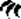

# Mechanics

## Adding a card to a stack

1. Adding a card to a stack means placing the card on top of the stack. If the stack was not empty, leave only the lower
   part of the previously top card visible.
1. This triggers deactivation of the upper part of the covered card – if any, and activation of the upper and lower part
   of the added card, simultaneously.

## Taking a card from a stack

1. Taking a card from a stack means taking the top card of a stack. The card that’s on top of the stack now – if any –
   is called the revealed card.
1. This triggers deactivation of the upper and lower parts of the taken card, and activation of the upper part of the
   revealed card – if any, simultaneously.

## Activating and deactivating parts of cards

1. Increase the attack power of the owner by the sum of the  icons on the activated parts
   and the  icons on the deactivated parts. Decrease the attack power of the owner by
   the sum of the  icons on the activated parts and the 
   icons on the deactivated parts. If the resulting value is less than zero, it becomes zero.
1. Increase the defense power of the owner by the sum of the  icons on the activated parts
   and the  icons on the deactivated parts. Decrease the defense power of the owner by
   the sum of the  icons on the activated parts and the 
   icons on the deactivated parts. If the resulting value is less than zero, it becomes zero.
1. If your pearl value is less than your pearl token count, discard tokens until they are equal. You choose which tokens
   to discard.
1. If you pearl value is more than your pearl token count, take pearl tokens from the supply and add them with the
   active side face up to your supply until they are equal.

## Burying the top card of a stack

1. Burying the top card of a stack means taking the top card of a stack, and placing it on the bottom of that stack,
   leaving only the lower part of this card visible. This card is called the buried card. The card that’s on top of the
   stack after the movement is called the revealed card.
1. A player cannot bury the top card of a stack if it contains less than two cards.
1. This triggers deactivation of the upper part of the buried card, and activation of the upper part of the revealed
   card, simultaneously.
1. Burying does not remove used labels on minor actions on the buried card.

## Unburying the bottom card of a stack

1. Unburying the bottom card of a stack means taking the bottom card of a stack and placing it on top of that stack.
   This card is called the unburied card. The card that was on top of the stack before the movement is called the
   covered card.
1. You cannot unbury the bottom card of a stack if it contains less than two cards.
1. This triggers deactivation of the upper part of the covered card, and activation of the upper part of the unburied
   card, simultaneously.
1. Unburying does not remove used labels on minor actions on the covered card.

## Determining health and strength

1. Monsters, dragons and Overlords have health and strength.
1. Set their health and strength equal to the values printed on their card.
1. Increase their health by a number equal to the number of  reinforcement tokens on the
   card.
1. Increase their strength by a number equal to the number of  reinforcement tokens on the
   card.
1. Apply all effects that change the health or strength of monsters, dragons or Overlords when determining their values.
1. If the desert token is in play:
    1. Set N to 1, then multiply it by 2 for each active effect that says “Double the effect of the Desert Token”.
    1. If you have the Ignore the desert token effect, N is 0.
    1. If the side with “+1 -1” is face up, increase their
       health by N, and decrease their strength by N.
    1. If the side with “+1 -1” is face up, increase their
       strength by N, and decrease their health by N.
1. For both values, if the value is less than zero, set it to zero.

## Taking damage

1. Taking X damage means taking X wound tokens.
1. In co-op mode, the players have one shared wound token pool. Otherwise, each player has his own wound token pool.
1. In non-co-op mode, as long as you have ten or more wound tokens, discard ten tokens, draw two cards from the wound
   deck and add one to your wound stack. Discard the other.

## Healing damage

1. Healing X damage means discarding X wound tokens.
1. In non-co-op mode, as long as you have fewer wound tokens than the amount of damage to heal and you have cards in
   your wound stack, discard the top card of your wound stack and take ten tokens.
1. In co-op mode, you discard from the shared wound token pool. Otherwise, you discard from your own pool.
1. If you have less than X wound tokens, discard all. Otherwise, discard X wound tokens.

## Moving a card from one player to another player

1. Moving a card means taking the card from a stack of one player and adding it to the stack of another player.
1. This removes all used labels on the card.

## Discarding a card

1. You cannot discard a card from the item deck or the enchantment deck if that deck contains less than two cards.
1. If the card is an adventure deck card, put it face up on top of the graveyard.
1. If the card is a wound card, Overlord card, Overlord event card, banner card, or class card, put it face down on the
   bottom of the associated deck.
1. Whenever multiple cards are discarded at the same time, the active player or else the starting player may discard
   them in any order.

## Discarding tokens

1. Discard tokens to the supply.

## Removing a card from the game

1. Put the card back into the box. It isn’t part of the game anymore.

## Attacking

1. Attacking takes place between two units, an attacker and a defender.
1. If the attacker is a creature or Overlord, use its strength as the attack power.
1. If the defender is a creature or Overlord, use its health as the defense power.
1. If the attacker has higher attack power than the defender’s defense power, the defender takes N×F damage. N is equal
   to the attacker’s attack power minus the defender’s defense power. F is equal to 1, unless the attacker deals double
   damage, then it’s 2.

## Dueling

1. Dueling takes place between two units: players and/or an Overlord.
1. Both units may use minor actions. They get this opportunity one by one, starting with the active player, moving
   clockwise.
1. If one of the units is an Overlord, use its strength as its attack power, and its health as its defense power.
1. Each unit attacks the other unit simultaneously. Units with “when dueling you do not attack” do not attack.
1. Calculate both damage values simultaneously, before applying the damage effects simultaneously.
1. If each player must duel in a two-player game, dueling takes place twice between the two players.

## Journeying to the graveyard

1. The active player may journey to the top card in the graveyard.
   Resolve [Journey results](gameplay.md#journey-results).

## The Overlord and crystals

1. If this is not a co-op game, skip this section.
1. If the active player gives crystals to the Overlord, store them on his card.
1. Whenever there are more than five crystals on the Overlord, discard 5 and add a reinforcement token, random side face
   up.
1. If a player must take crystals from the Overlord, take as many from its card as you can, then take the rest from the
   supply.

## The Overlord and cards

1. If this is not a co-op game, skip this section.
1. If a player must give one of his cards to the Overlord due to any effect that’s not part of the Overlord’s own
   abilities, he discards it instead.
1. If the Overlord must give one of his cards, or discard one of his cards, do nothing instead.
1. In both cases, if this action would be considered positive for the player or negative for the Overlord, remove one
   reinforcement token of his choice from the Overlord card. Otherwise add one reinforcement token to the Overlord card,
   with a random side up.
